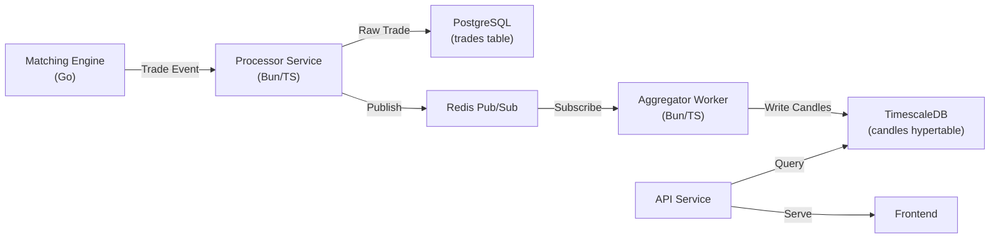

# Timeline Data Architecture — Production Proposal

## Problem

The current timeline data comes from a flat array of trade events. There's no proper aggregation, bucketing, or storage layer for historical candle/OHLC data. The timeframe buttons (1H, 6H, 1D, 1W, 1M, ALL) need server-side bucketed data to work correctly at scale.

---

## Architecture Overview



---

## Database Choice

| Option | Pros | Cons | Verdict |
|--------|------|------|---------|
| **TimescaleDB** (PostgreSQL extension) | Same Postgres stack, hypertables, continuous aggregates, compression, mature SQL | Slightly heavier than pure Redis | **Recommended** ✅ |
| **ClickHouse** | Blazing fast analytics, column-oriented | Separate infra, overkill for our scale | Too complex |
| **Redis TimeSeries** | In-memory, ultra fast reads | Data persistence concerns, limited query flexibility | Good for real-time cache |
| **Plain PostgreSQL** | Already have it, no new infra | Manual bucketing queries, no built-in time optimizations | Viable fallback |

> [!TIP]
> **Recommendation: TimescaleDB** — It's a PostgreSQL extension, so you keep your existing Postgres setup. Just enable the extension and create hypertables. You get automatic time-based partitioning, continuous aggregates (materialized views that auto-update), and data compression — all with standard SQL.

---

## Schema Design

### 1. Raw Trades Table (already exists, minor additions)

```sql
-- Your existing trades table, ensure these columns exist:
CREATE TABLE trades (
    id          UUID PRIMARY KEY DEFAULT gen_random_uuid(),
    market_id   VARCHAR(64) NOT NULL,
    symbol      VARCHAR(32) NOT NULL,
    side        VARCHAR(4) NOT NULL,        -- 'YES' | 'NO'
    price       DECIMAL(10,2) NOT NULL,
    quantity    INTEGER NOT NULL,
    timestamp   TIMESTAMPTZ NOT NULL DEFAULT NOW(),
    
    -- Indexes
    INDEX idx_trades_market_time (market_id, timestamp DESC)
);
```

### 2. Candles Hypertable (NEW — TimescaleDB)

```sql
-- Enable TimescaleDB
CREATE EXTENSION IF NOT EXISTS timescaledb;

-- Create the candles table
CREATE TABLE candles (
    market_id    VARCHAR(64) NOT NULL,
    bucket       TIMESTAMPTZ NOT NULL,        -- Start of the time bucket
    resolution   VARCHAR(4) NOT NULL,          -- '1m', '5m', '15m', '1h', '1d'
    yes_open     DECIMAL(10,2),
    yes_high     DECIMAL(10,2),
    yes_low      DECIMAL(10,2),
    yes_close    DECIMAL(10,2),
    no_open      DECIMAL(10,2),
    no_high      DECIMAL(10,2),
    no_low       DECIMAL(10,2),
    no_close     DECIMAL(10,2),
    volume       INTEGER DEFAULT 0,
    trade_count  INTEGER DEFAULT 0,
    
    PRIMARY KEY (market_id, bucket, resolution)
);

-- Convert to hypertable (auto-partitions by time)
SELECT create_hypertable('candles', 'bucket');

-- Create index for fast lookups
CREATE INDEX idx_candles_market_res ON candles (market_id, resolution, bucket DESC);
```

### 3. Continuous Aggregates (Auto-Rollups)

```sql
-- 1-minute candles from raw trades (base resolution)
CREATE MATERIALIZED VIEW candles_1m
WITH (timescaledb.continuous) AS
SELECT
    market_id,
    time_bucket('1 minute', timestamp) AS bucket,
    -- YES side
    first(price, timestamp) FILTER (WHERE side = 'YES') AS yes_open,
    max(price) FILTER (WHERE side = 'YES') AS yes_high,
    min(price) FILTER (WHERE side = 'YES') AS yes_low,
    last(price, timestamp) FILTER (WHERE side = 'YES') AS yes_close,
    -- NO side
    first(price, timestamp) FILTER (WHERE side = 'NO') AS no_open,
    max(price) FILTER (WHERE side = 'NO') AS no_high,
    min(price) FILTER (WHERE side = 'NO') AS no_low,
    last(price, timestamp) FILTER (WHERE side = 'NO') AS no_close,
    -- Aggregates
    sum(quantity) AS volume,
    count(*) AS trade_count
FROM trades
GROUP BY market_id, time_bucket('1 minute', timestamp);

-- Auto-refresh policy: refresh every 1 minute, covering the last 10 minutes
SELECT add_continuous_aggregate_policy('candles_1m',
    start_offset => INTERVAL '10 minutes',
    end_offset => INTERVAL '1 minute',
    schedule_interval => INTERVAL '1 minute'
);
```

---

## Resolution Mapping

| Frontend Timeframe | Query Resolution | Max Points | Lookback |
|---|---|---|---|
| `1H` | `1m` candles | 60 | 1 hour |
| `6H` | `5m` candles | 72 | 6 hours |
| `1D` | `15m` candles | 96 | 24 hours |
| `1W` | `1h` candles | 168 | 7 days |
| `1M` | `4h` candles | 180 | 30 days |
| `ALL` | `1d` candles | unlimited | all time |

---

## Data Flow

### Step 1: Trade Happens (Matching Engine → Processor)

The matching engine already emits trade events. The processor service writes the raw trade to the `trades` table and publishes to Redis.

### Step 2: Aggregator Worker (NEW service or cron job)

Two approaches:

**Option A — TimescaleDB Continuous Aggregates (Recommended)**
- TimescaleDB automatically maintains the materialized views
- No separate aggregator worker needed
- Just query the continuous aggregate views directly

**Option B — Manual Worker**
- A background worker subscribes to trade events
- On each trade, it updates the current 1-minute candle in-memory
- Every minute, it flushes to the `candles` table
- Higher resolutions (5m, 15m, 1h, 1d) are rolled up from 1m candles via a cron job

### Step 3: API Endpoint (NEW)

```typescript
// GET /api/v1/markets/:symbol/candles?resolution=1m&from=2024-01-01&to=2024-01-31

interface CandleQuery {
    symbol: string;
    resolution: '1m' | '5m' | '15m' | '1h' | '4h' | '1d';
    from?: string;     // ISO datetime
    to?: string;       // ISO datetime  
    timeframe?: '1H' | '6H' | '1D' | '1W' | '1M' | 'ALL';  // Shortcut
}

interface CandleResponse {
    candles: {
        time: number;       // Unix timestamp ms
        yesOpen: number;
        yesHigh: number;
        yesLow: number;
        yesClose: number;
        noOpen: number;
        noHigh: number;
        noLow: number;
        noClose: number;
        volume: number;
    }[];
}
```

### Step 4: Frontend Integration

```typescript
// Timeline.tsx — Replace current data fetch
const fetchCandles = async (symbol: string, timeframe: Timeframe) => {
    const res = await api.get(`/markets/${symbol}/candles`, {
        params: { timeframe }
    });
    return res.data.candles;
};

// On timeframe change, fetch new data from server
useEffect(() => {
    fetchCandles(symbol, timeframe).then(setChartData);
}, [symbol, timeframe]);
```

---

## Implementation Steps (Tomorrow)

### Phase 1: Database Setup (30 min)
1. Install TimescaleDB extension on your PostgreSQL instance
2. Create the `candles` hypertable
3. Create the continuous aggregate view
4. Set up the refresh policy

### Phase 2: API Endpoint (1 hour)
1. Add `GET /markets/:symbol/candles` endpoint to api-service
2. Map `timeframe` parameter to resolution + lookback
3. Query the continuous aggregate or candles table
4. Return formatted response

### Phase 3: Frontend Integration (30 min)
1. Update `Timeline.tsx` to fetch from the new endpoint
2. Replace client-side filtering with server-fetched data
3. Add loading state while fetching new timeframe

### Phase 4: Real-time Updates (30 min)
1. On each new trade via WebSocket, append to the current candle
2. Use Redis to cache the "current open candle" for instant reads
3. Merge real-time data with historical candles on the frontend

---

## Production Considerations

> [!IMPORTANT]
> **Data Compression**: TimescaleDB can compress old candle data by 90%+. Enable compression for data older than 7 days:
> ```sql
> ALTER TABLE candles SET (
>     timescaledb.compress,
>     timescaledb.compress_segmentby = 'market_id,resolution'
> );
> SELECT add_compression_policy('candles', INTERVAL '7 days');
> ```

> [!NOTE]
> **Fallback**: If TimescaleDB isn't available in your deployment, you can use plain PostgreSQL with a manual `time_bucket` function (a simple `date_trunc` + interval math) and a cron job to roll up 1m candles into higher resolutions. It's less elegant but works fine at moderate scale.

> [!TIP]
> **Redis Cache Layer**: For the most recent candle (current minute), cache it in Redis with key `candle:{marketId}:1m:current`. This avoids hitting the DB for real-time chart updates. TTL = 90 seconds.
